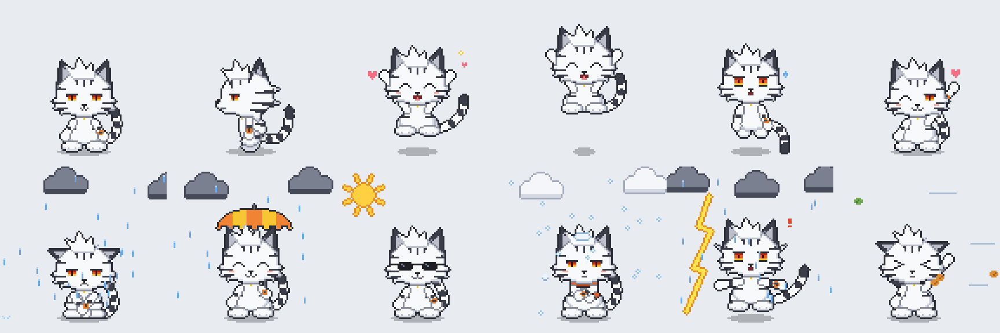

# 三虎 Sanhuu · 像素桌面宠物

> **版权声明**
> 美术素材版权 © 三虎 Sanhuu,保留所有权利。未经许可,禁止商用、二次修改、转载传播。 代码部分可按需参考使用,请保留版权声明与原作者署名。

一只住在桌面上的 Q 版像素小老虎「三虎 Sanhuu」:白毛、黑色虎纹、橙色眼睛。
Windows 与 macOS 共用一套**原生桌面代码**(Qt Widgets),不含任何 HTML / WebView / 浏览器内核。



## 它会做什么

| 功能 | 说明 |
| --- | --- |
| 逐帧动画 | 25 组动画、818 帧,每一帧都按姿势重新逐像素绘制:待机(9 个视线方向)、走路、开心、跳跃、落地、被拎起、挣扎、卖萌、睡觉、干活,以及 6 种天气 |
| 天气 | 首次启动设置城市;晴 / 多云 / 雨 / 雪 / 雷雨 / 大风各有一段 10 秒动画。未来 3 小时要变天时主动提醒(下雨:望天 → 抱膝发抖流泪 → 掏出雨伞) |
| 截图 | 全屏 / 选择窗口 / 框选;保存 PNG 并复制到剪贴板 |
| 录屏 | 全屏 / 窗口 / 框选;窗口模式下鼠标移到哪个窗口就高亮哪个,单击确认。输出 MP4 或 GIF,分辨率为屏幕物理像素,帧率跟随显示器刷新率 |
| 格式转换 | 把文件拖到三虎身上:图片 ↔ png / jpg / webp / ico / bmp / gif / tiff / icns / pdf;txt / md / docx ↔ pdf / docx / txt / md;pdf → txt / png / jpg;视频 → gif / mp4 / webm / mov / mkv / avi / mp3;音频互转 |
| 压缩 / 解压 | 压缩为 zip / 7z / rar,可设密码(zip、7z 为 AES-256);解压 zip / 7z / rar(含带密码的) |
| 定时任务 | 定时提醒、定时关机 / 睡眠 / 重启,支持每天重复和倒计时;电源动作前有 30 秒可取消的倒计时 |
| 待办 | 增删、完成、优先级、截止日期、逾期提示 |
| 鼠标交互 | 单击:卖萌 + 菜单;双击:溜达;拖拽:被拎起,甩得快会挣扎,松手落地;鼠标靠近:视线跟随;在身上来回蹭:摸头;滚轮:缩放 |

## 安装

本仓库提供**安装程序的完整工程**,在对应系统上一条命令即可生成安装包:

- **Windows**(需 Python 3.10+、[Inno Setup 6](https://jrsoftware.org/isdl.php)、建议装 7-Zip)
  ```powershell
  powershell -ExecutionPolicy Bypass -File packaging\windows\build_windows.ps1
  ```
  产物:`dist\Sanhuu-Setup-1.0.0.exe` —— 三虎主题的安装向导(角色插画、中文文案、版权声明页、"你在哪座城市"自定义页、桌面图标与开机自启选项)。

- **macOS**(需 Python 3.10+,建议 `brew install sevenzip`)
  ```bash
  ./packaging/macos/build_macos.sh
  ```
  产物:`dist/Sanhuu-1.0.0.dmg` —— 带三虎插画背景的安装窗口,把三虎拖进"应用程序"即可。

- **不想在本机构建**:把仓库推到 GitHub,`.github/workflows/build.yml` 会在云端同时产出两个安装包(Actions → build-installers → Run workflow)。

### 直接从源码运行(两个系统通用)

```bash
pip install -r requirements.txt
python run.py
```

### 首次运行的系统提示

- **macOS**:截图 / 录屏需要在 *系统设置 → 隐私与安全性 → 屏幕录制* 中允许 Sanhuu;定时关机 / 重启会请求"自动化"权限。安装包未做 Apple 公证,首次打开请右键 →"打开"。
- **Windows**:安装包未做代码签名,SmartScreen 可能提示"未知发布者",选"仍要运行"。

## 需要知道的限制

- **压缩成 rar**:RAR 是专有格式,任何开源库都不能创建 rar。三虎会调用电脑上已安装的 WinRAR / `rar` 命令行;没装时会提示改用 7z 或 zip。解压 rar 不受影响(安装版内置 7-Zip)。
- **窗口录制**录的是该窗口所在的屏幕区域,录制期间请不要移动或遮挡这个窗口。
- **GIF 帧率**受格式本身限制最高 50 fps;**macOS** 系统屏幕采集接口最高 60 fps。
- 天气数据来自 Open-Meteo,需要联网。

## 目录结构

```
run.py                 启动入口
sanhuu/                应用代码(Qt Widgets)
assets/sprites/        精灵表 + sprites.json(动画元数据)
assets/installer/      安装程序插图
assets/reference/      角色三视图原画
tools/                 像素骨架与素材生成脚本
packaging/             PyInstaller 配置、Inno Setup 脚本、DMG 配置
tests/smoke_test.py    无头冒烟测试
AGENTS.md              给其他 AI Agent / 开发者的说明
```

## 使用的开源项目

Qt for Python (PySide6, LGPL-3.0) · FFmpeg(经 imageio-ffmpeg 分发)· Pillow · pyzipper · py7zr · 7-Zip · pypdf · pypdfium2 · python-docx · Open-Meteo(天气数据,CC BY 4.0)。

---

美术素材版权 © 三虎 Sanhuu,保留所有权利。未经许可,禁止商用、二次修改、转载传播。 代码部分可按需参考使用,请保留版权声明与原作者署名。
